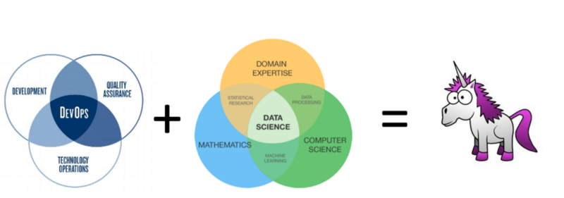
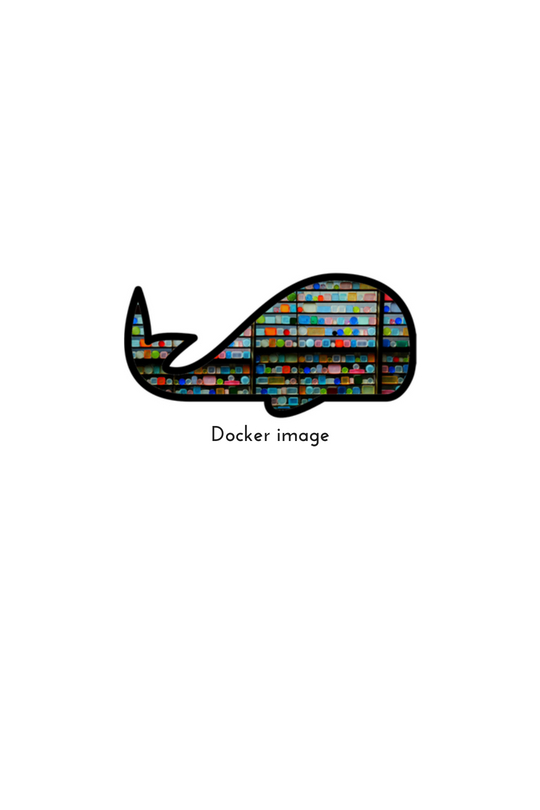
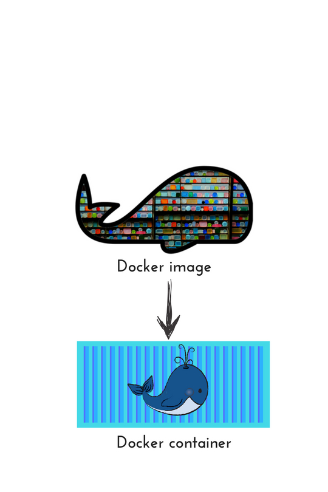
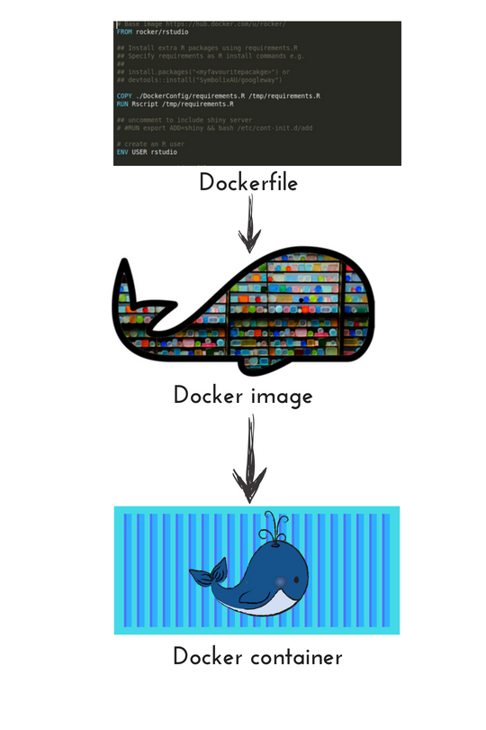
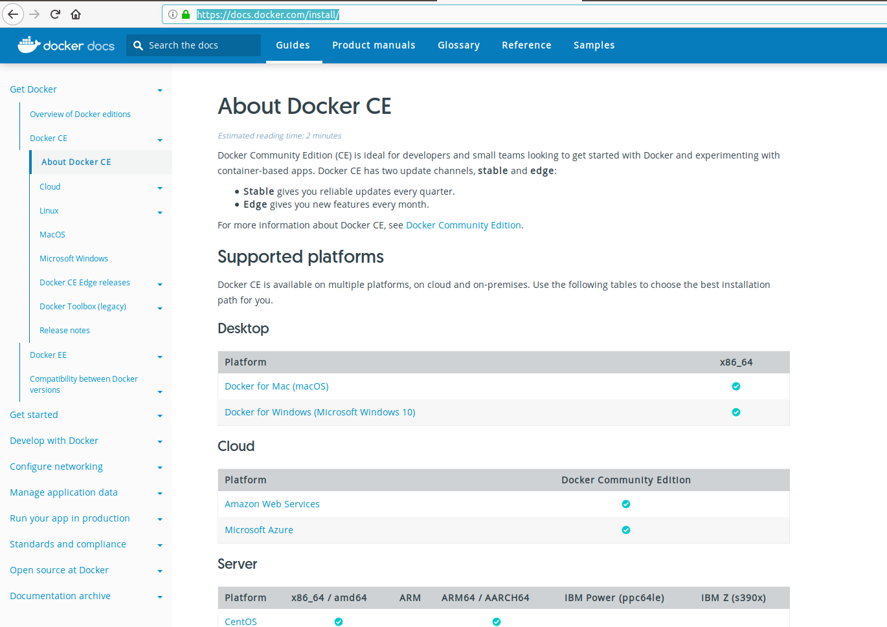
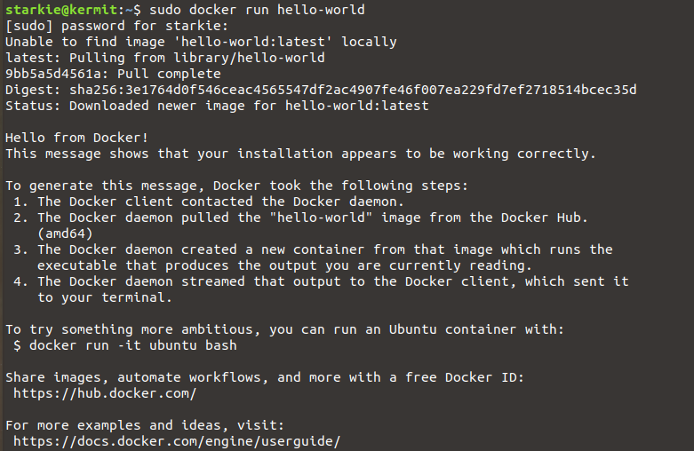
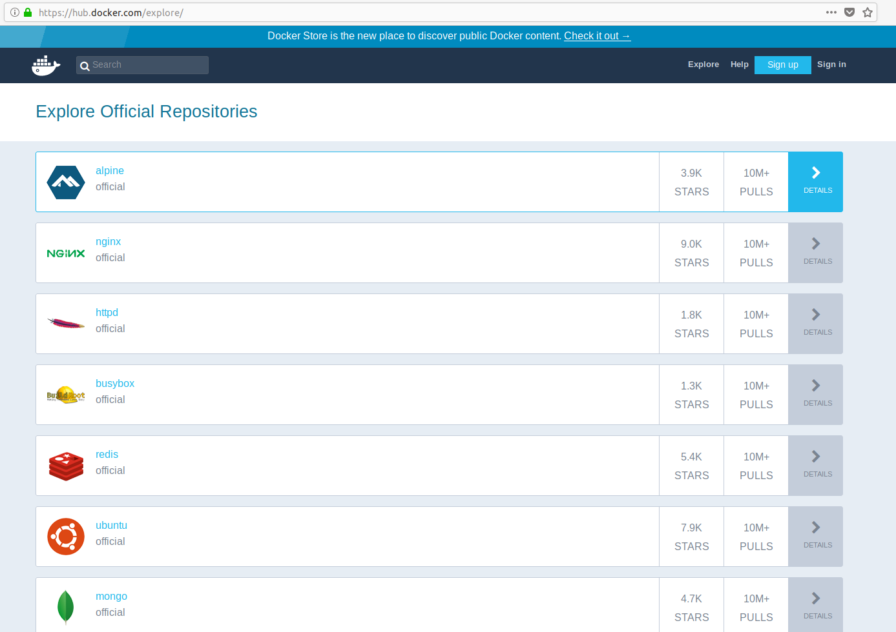

```{r setup, include=FALSE}
options(htmltools.dir.version = FALSE)
library(knitr)
library(kableExtra)
```

```{r theme, include = FALSE}
# see https://github.com/gadenbuie/xaringanthemer
# and https://clrs.cc/ for beautiful colours

library(xaringanthemer)
duo_accent(
  primary_color  = "#001f3f",
  secondary_color = "#3D9970",
  text_bold_color = "#3D9970",
  header_font_google = google_font("Josefin Sans"),
  text_font_google   = google_font("Montserrat", "300", "300i"),
  code_font_google   = google_font("Droid Mono"),
  table_row_even_background_color = lighten_color("#3D9970", 0.9)
)

```

# Some housekeeping

* ** 9:00 - 10:00** : A bit of a story about people and containers*

* **10:00 - 10:30** : A hello-world example to try

* **10:30 - 11:00** :  ☕☕

* **11:00 - 12:30** : More yarns and hand-on code time

.footnote[[*] disclaimer - there is only a little bit of actual `R` today]

---

background-image: url("images/what-am-i-doing-here.jpg")
background-size: contain


???

* I started my dev life building BASIC programs to spit out endless loops of insults aimed at my brother
* I tried to be an archeologist (no patience)
* I discovered that maths was a language and `maths+computers+stars == astrophysics` so that's what I did
* I discovered that acedemia was not for me
* I got to work as a communicator - telling stories to teach kids about maths+physics

* I own a company that uses maths and computers to solve problems.  

* 

---

# Symbolix's story


.pull-left[

* Data science / augmented intelligence
    + Analysis-as-a-service + 
    + tools for other teams
  
* We work in
	+ Transport & urban networks
	+ Environmental management
	+ Better organisations

* R and open source
	+ `googleway`
	+ `googlePolylines`
	+ `geojsonsf`

]
.pull-right[

.image-50[]
]

---

# Our journey

```{r, echo = FALSE}

df <- data.frame(When = c("The deep past", "Many years ago", "A few years ago", "Now"),
                 Analysis = c("R or excel", "R scripts", "R scripts + knitr",
                              "R - scripts, packages, apps, bookdown, wrappers"),
                 `Packaged by` = c("Word reports", "Word reports", "Knitr + shiny",
                                 "R bookdown, shiny, xarigan, ...")
                              )

    knitr::kable(df, format = "html", align = "l" ) %>% 
        kableExtra::column_spec(1:3, width = "33%")


```


---
class: inverse, center, middle


# A typical analyst's story


---
background-image: url("images/Recosystem1.jpg")
background-size: contain


???
This is what we often think the R ecosystem looks like - a lone analyst, using their own setup, with their own environment with their own data sets. Maybe those files are local, or stored in a database, or scraped off the web somwhere (using the analysts own API keys)


---
background-image: url("images/Recosystem2.jpg")
background-size: contain
???
And they are working on ad hoc analysis in that environment

---

background-image: url("images/Recosystem3.jpg")
background-size: contain

???
But it's more complicated - you have your own setup, and you want to share the results with others. Maybe publish to a report or share a dashboard, or publish a shiny.

Or maybe you are working with other analysts in a team and need to share your code so they can help develop the package or fix a bug


---

# Some difficult things

Sharing:
* Your user might have **different package or R versions** installed
* Your scripts might need **secret keys** to run 
* Some packages require **non-R packages** in the background environment<sup>*</sup>

On your own
* You might need to deploy **multiple runs** of the same script with different inputs
* You might want to try out some **development ideas**
* You might need to rerun the code six months later and **reproduce** the output


.footnote[[*] e.g. `sf` needs GEOS/GDAL and keras/tensorflow require python libs]

---

background-image: url("images/phd011406s.gif")
background-size: contain

---

class: center, middle

# Being an **analyst** (data scientist) is not enough to manage this


---

# Two types of data scientist

.pull-left[
	.image-90[ ]
]
.pull-right[.roomy[
**Analyst** data scientist wrangles data, builds models and designs reports to answer business questions.

**Builder** data scientist uses programming and development skills to prepare machine learning models/algorthms to run **in production**, usually for someone else
]]
 
???

Many data scientists I know (at least those working with R) fall on the analyst end of the spectrum

---

## You can't be a unicorn on your own

.image90[]

.footnote[https://towardsdatascience.com/devops-for-data-scientists-taming-the-unicorn-6410843990de]

---

# Developer tools for R users

* Basics (R projects)

--

* **Packages** (`Roxygen`)
* **Unit tests** (e.g. `testthat`)

--

* **Code management** & versions (Github)

* **Master Data Management** (MariaDB, MongoDB, S3 file storage)

* **Teams & Projects** (Slack, Trello, Clubhouse, github projects/wiki)

--

### **Deployment & Code Bundles**.....


---

background-image: url("images/dockerEnv.jpg")
background-size: contain
background-position: center bottom

# Bundling code with Docker

???

Docker makes it easier to move code, archive code, run multiple copies of codes, or to archive a specific version of an analysis.

Instead of sending an individual R script, you bundle together all the scripts, libraries, settings you use into a single 'app' container.  This is easy to use and will run the same on any platform - your code won't care if it's on mac, windows or linux. It won't care whether its on your carefully curated analysis machine, or chucked on a cloud server you started 5 minutes ago.

As an example (and I will show you this later if there is time) when I first set up a cloud server for rstudio and shiny, it took my hours of pouring through tutorials, settings, installing libraries - realising I needed linux libraries, installing them etc.  Last week I had to set up a demonstration R studio server for a client and it took five minutes from logging into AWS through to having an R studio server instance running in my browser window.


---
class: center, inverse
background-image: url("images/laurel-docker-containers.png")
background-size: contain
background-position: 50% 90%

# What is Docker?

???

Enough of the sales pitch - lets get under the hood and see how it works

---

.pull-left[

## Container


]

.pull-right[

## Virtual machine


]


???

This is th offical image from Docker docs and I include it in case some of you have worked with Virtual machines before

Some of you will have used virtual machines (or heard of them).  
We started with physical servers - you had to have everything share the same physical server and manually manage resources and libraries etc
Then virtual machines are essentialy a machine within a machine - each has it's own OS, and virtual versions of drivers etc.  

Docker is a much more lightweight version of a virtual machine.  It uses the existing hardware and kernel (the core codes of your operating system) and overlays libraries, apps, environment variables within it's own micro environment.

So it may feel like you have just logged into an ubuntu linux server, but it's using the Docker service to use the inner core drivers of your Mac or windows OS.  

---

class: inverse, middle, center

# Some definitions


---
class: middle

.pull-left[
	.image-90[]
]

.pull-right[.roomy[

.fade[A Dockerfile is the control script that compiles everything into the image.]

An **image** is a self contained, executable bundle of codes, settings, environment variables that you use to run the code.

.fade[A container is a single running instance of the image bundle.]

]]


???

Think of it as an **app** executable, or a **class** definition (for the "B" types)
 
---
class: middle

.pull-left[
	.image-90[]
]

.pull-right[.roomy[

.fade[A Dockerfile is the control script that compiles everything into the image.

An image is a self contained, executable bundle of codes, settings, environment variables that you use to run the code.
]

A **container** is a single running instance of the image bundle.
 	

]]

???

Think of it as a running **app** executable, or an instance of a **class**

---
class: middle

.pull-left[
	.image-90[]
]

.pull-right[.roomy[

A **Dockerfile** is the control script that compiles everything into the image.
 

.fade[An image is a self contained, executable bundle of codes, settings, environment variables that you use to run the code.


A **container** is a single running instance of the image bundle.]

]]

???

Think of it like a **Makefile** 


---

class: inverse, center, middle

# Hello world!


---
# Install Docker


.image90[
[ 

](
https://docs.docker.com/install/
)
]

---

# Postinstall for linux

**NOTE**  By default Docker is run by the `root` user so you need `sudo` for every command.  

This site has instructions to allow users access to Docker without sudo: https://docs.docker.com/install/linux/linux-postinstall/

**BUT** This allows anyone in the `Docker` group un-password-protected and unlogged root privleges.  

**So** Read this article and if you get what it's saying, you can follow their advice.  If it is not clear, just leave the sudo in place.
http://www.projectatomic.io/blog/2015/08/why-we-dont-let-non-root-users-run-docker-in-centos-fedora-or-rhel/


---

# Basic docker commands<sup>*</sup>


```
## List Docker CLI commands
docker
docker container --help

## Display Docker version and info
docker --version
docker version
docker info

## Execute Docker image
docker run hello-world

## List Docker images
docker image ls

## List Docker containers (running, all, all in quiet mode)
docker container ls
docker container ls --all
docker container ls -aq

```

.footnote[[*] linux users will need `sudo` in front of all commands ]

---

# Our first container

```
docker run hello-world
```




---

background-image: url("images/architecture.svg")
background-size: contain


???

Right....but how does this container thing work?

---
# Definitions

**Registry** Repository of Docker images

**Docker Hub** Docker's own registry

**tag** Images have tags to indicate specific versions

--


**docker pull** Get latest version from repository

**docker build** Compile image into container

**docker run** Run the container

---

# Docker Hub

.image90[[

](https://hub.docker.com/explore)]

---

class: inverse, center, middle

# The R bit!

[https://hub.docker.com/u/rocker/](https://hub.docker.com/u/rocker/)


---
# Build context

.pull-left[
 


]

.pull-right[

The `build` command includes **all files / folders** underneath your working directory, recursively in the image build context

Use `.dockerignore` file to exclude unnecessary files

Limit installed packages to necessary ones too

**Larger images == slower build, slower push and sad life** ☹

]


---


---
class: center

# Containers are **ephemeral**


---


background-image: url(https://upload.wikimedia.org/wikipedia/commons/b/be/Sharingan_triple.svg)

???

Image credit: [Wikimedia Commons](https://commons.wikimedia.org/wiki/File:Sharingan_triple.svg)

---
class: center, middle

# xaringan

### /ʃæ.'riŋ.ɡæn/

---
class: inverse, center, middle

# Get Started

---

# Hello World

Install the **xaringan** package from [Github](https://github.com/yihui/xaringan):

```{r eval=FALSE, tidy=FALSE}
devtools::install_github("yihui/xaringan")
```

--

You are recommended to use the [RStudio IDE](https://www.rstudio.com/products/rstudio/), but you do not have to.

- Create a new R Markdown document from the menu `File -> New File -> R Markdown -> From Template -> Ninja Presentation`;<sup>1</sup>

--

- Click the `Knit` button to compile it;

--

- or use the [RStudio Addin](https://rstudio.github.io/rstudioaddins/)<sup>2</sup> "Infinite Moon Reader" to live preview the slides (every time you update and save the Rmd document, the slides will be automatically reloaded in RStudio Viewer.

.footnote[
[1] 中文用户请看[这份教程](http://slides.yihui.name/xaringan/zh-CN.html)

[2] See [#2](https://github.com/yihui/xaringan/issues/2) if you do not see the template or addin in RStudio.
]

---
background-image: url(`r xaringan:::karl`)
background-position: 50% 50%
class: center, bottom, inverse

# You only live once!

---

# Hello Ninja

As a presentation ninja, you certainly should not be satisfied by the "Hello World" example. You need to understand more about two things:

1. The [remark.js](https://remarkjs.com) library;

1. The **xaringan** package;

Basically **xaringan** injected the chakra of R Markdown (minus Pandoc) into **remark.js**. The slides are rendered by remark.js in the web browser, and the Markdown source needed by remark.js is generated from R Markdown (**knitr**).

---

# remark.js

You can see an introduction of remark.js from [its homepage](https://remarkjs.com). You should read the [remark.js Wiki](https://github.com/gnab/remark/wiki) at least once to know how to

- create a new slide (Markdown syntax<sup>*</sup> and slide properties);

- format a slide (e.g. text alignment);

- configure the slideshow;

- and use the presentation (keyboard shortcuts).

It is important to be familiar with remark.js before you can understand the options in **xaringan**.

.footnote[[*] It is different with Pandoc's Markdown! It is limited but should be enough for presentation purposes. Come on... You do not need a slide for the Table of Contents! Well, the Markdown support in remark.js [may be improved](https://github.com/gnab/remark/issues/142) in the future.]

---
background-image: url(`r xaringan:::karl`)
background-size: cover
class: center, bottom, inverse

# I was so happy to have discovered remark.js!

---
class: inverse, middle, center

# Using xaringan

---

# xaringan

Provides an R Markdown output format `xaringan::moon_reader` as a wrapper for remark.js, and you can use it in the YAML metadata, e.g.

```yaml
---
title: "A Cool Presentation"
output:
  xaringan::moon_reader
    yolo: true
    nature:
      autoplay: 30000
---
```

See the help page `?xaringan::moon_reader` for all possible options that you can use.

---

# remark.js vs xaringan

Some differences between using remark.js (left) and using **xaringan** (right):

.pull-left[
1. Start with a boilerplate HTML file;

1. Plain Markdown;

1. Write JavaScript to autoplay slides;

1. Manually configure MathJax;

1. Highlight code with `*`;

1. Edit Markdown source and refresh browser to see updated slides;
]

.pull-right[
1. Start with an R Markdown document;

1. R Markdown (can embed R/other code chunks);

1. Provide an option `autoplay`;

1. MathJax just works;<sup>*</sup>

1. Highlight code with `{{}}`;

1. The RStudio addin "Infinite Moon Reader" automatically refreshes slides on changes;
]

.footnote[[*] Not really. See next page.]

---

# Math Expressions

You can write LaTeX math expressions inside a pair of dollar signs, e.g. &#36;\alpha+\beta$ renders $\alpha+\beta$. You can use the display style with double dollar signs:

```
$$\bar{X}=\frac{1}{n}\sum_{i=1}^nX_i$$
```

$$\bar{X}=\frac{1}{n}\sum_{i=1}^nX_i$$

Limitations:

1. The source code of a LaTeX math expression must be in one line, unless it is inside a pair of double dollar signs, in which case the starting `$$` must appear in the very beginning of a line, followed immediately by a non-space character, and the ending `$$` must be at the end of a line, led by a non-space character;

1. There should not be spaces after the opening `$` or before the closing `$`.

1. Math does not work on the title slide (see [#61](https://github.com/yihui/xaringan/issues/61) for a workaround).

---

# R Code

```{r comment='#'}
# a boring regression
fit = lm(dist ~ 1 + speed, data = cars)
coef(summary(fit))
dojutsu = c('地爆天星', '天照', '加具土命', '神威', '須佐能乎', '無限月読')
grep('天', dojutsu, value = TRUE)
```

---

# R Plots

```{r cars, fig.height=4, dev='svg'}
par(mar = c(4, 4, 1, .1))
plot(cars, pch = 19, col = 'darkgray', las = 1)
abline(fit, lwd = 2)
```

---

# Tables

If you want to generate a table, make sure it is in the HTML format (instead of Markdown or other formats), e.g.,

```{r}
knitr::kable(head(iris), format = 'html')
```

---

# HTML Widgets

I have not thoroughly tested HTML widgets against **xaringan**. Some may work well, and some may not. It is a little tricky.

Similarly, the Shiny mode (`runtime: shiny`) does not work. I might get these issues fixed in the future, but these are not of high priority to me. I never turn my presentation into a Shiny app. When I need to demonstrate more complicated examples, I just launch them separately. It is convenient to share slides with other people when they are plain HTML/JS applications.

See the next page for two HTML widgets.

---

```{r out.width='100%', fig.height=6, eval=require('leaflet')}
library(leaflet)
leaflet() %>% addTiles() %>% setView(-93.65, 42.0285, zoom = 17)
```

---

```{r eval=require('DT'), tidy=FALSE}
DT::datatable(
  head(iris, 10),
  fillContainer = FALSE, options = list(pageLength = 8)
)
```

---

# Some Tips

- When you use the "Infinite Moon Reader" addin in RStudio, your R session will be blocked by default. You can click the red button on the right of the console to stop serving the slides, or use the _daemonized_ mode so that it does not block your R session. To do the latter, you can set the option

    ```r
    options(servr.daemon = TRUE)
    ```
    
    in your current R session, or in `~/.Rprofile` so that it is applied to all future R sessions. I do the latter by myself.
    
    To know more about the web server, see the [**servr**](https://github.com/yihui/servr) package.

--

- Do not forget to try the `yolo` option of `xaringan::moon_reader`.

    ```yaml
    output:
      xaringan::moon_reader:
        yolo: true
    ```

---

# Some Tips

- Slides can be automatically played if you set the `autoplay` option under `nature`, e.g. go to the next slide every 30 seconds in a lightning talk:

    ```yaml
    output:
      xaringan::moon_reader:
        nature:
          autoplay: 30000
    ```

--

- A countdown timer can be added to every page of the slides using the `countdown` option under `nature`, e.g. if you want to spend one minute on every page when you give the talk, you can set:

    ```yaml
    output:
      xaringan::moon_reader:
        nature:
          countdown: 60000
    ```

    Then you will see a timer counting down from `01:00`, to `00:59`, `00:58`, ... When the time is out, the timer will continue but the time turns red.
    
---

# Some Tips

- The title slide is created automatically by **xaringan**, but it is just another remark.js slide added before your other slides.

    The title slide is set to `class: center, middle, inverse, title-slide` by default. You can change the classes applied to the title slide with the `titleSlideClass` option of `nature` (`title-slide` is always applied).

    ```yaml
    output:
      xaringan::moon_reader:
        nature:
          titleSlideClass: [top, left, inverse]
    ```
    
--

- If you'd like to create your own title slide, disable **xaringan**'s title slide with the `seal = FALSE` option of `moon_reader`.

    ```yaml
    output:
      xaringan::moon_reader:
        seal: false
    ```

---

# Some Tips

- There are several ways to build incremental slides. See [this presentation](https://slides.yihui.name/xaringan/incremental.html) for examples.

- The option `highlightLines: true` of `nature` will highlight code lines that start with `*`, or are wrapped in `{{ }}`, or have trailing comments `#<<`;

    ```yaml
    output:
      xaringan::moon_reader:
        nature:
          highlightLines: true
    ```

    See examples on the next page.

---

# Some Tips


.pull-left[
An example using a leading `*`:

    ```r
    if (TRUE) {
    ** message("Very important!")
    }
    ```
Output:
```r
if (TRUE) {
* message("Very important!")
}
```

This is invalid R code, so it is a plain fenced code block that is not executed.
]

.pull-right[
An example using `{{}}`:

    `r ''````{r tidy=FALSE}
    if (TRUE) {
    *{{ message("Very important!") }}
    }
    ```
Output:
```{r tidy=FALSE}
if (TRUE) {
{{ message("Very important!") }}
}
```

It is valid R code so you can run it. Note that `{{}}` can wrap an R expression of multiple lines.
]

---

# Some Tips

An example of using the trailing comment `#<<` to highlight lines:

````markdown
`r ''````{r tidy=FALSE}
library(ggplot2)
ggplot(mtcars) + 
  aes(mpg, disp) + 
  geom_point() +   #<<
  geom_smooth()    #<<
```
````

Output:

```{r tidy=FALSE, eval=FALSE}
library(ggplot2)
ggplot(mtcars) + 
  aes(mpg, disp) + 
  geom_point() +   #<<
  geom_smooth()    #<<
```

---

# Some Tips

- To make slides work offline, you need to download a copy of remark.js in advance, because **xaringan** uses the online version by default (see the help page `?xaringan::moon_reader`).

- You can use `xaringan::summon_remark()` to download the latest or a specified version of remark.js. By default, it is downloaded to `libs/remark-latest.min.js`.

- Then change the `chakra` option in YAML to point to this file, e.g.

    ```yaml
    output:
      xaringan::moon_reader:
        chakra: libs/remark-latest.min.js
    ```

- If you used Google fonts in slides (the default theme uses _Yanone Kaffeesatz_, _Droid Serif_, and _Source Code Pro_), they won't work offline unless you download or install them locally. The Heroku app [google-webfonts-helper](https://google-webfonts-helper.herokuapp.com/fonts) can help you download fonts and generate the necessary CSS.

---

# Macros

- remark.js [allows users to define custom macros](https://github.com/yihui/xaringan/issues/80) (JS functions) that can be applied to Markdown text using the syntax `![:macroName arg1, arg2, ...]` or ``. For example, before remark.js initializes the slides, you can define a macro named `scale`:

    ```js
    remark.macros.scale = function (percentage) {
      var url = this;
      return '';
    };
    ```

    Then the Markdown text

    ```markdown
    
    ```

    will be translated to
    
    ```html
    
    ```

---

# Macros (continued)

- To insert macros in **xaringan** slides, you can use the option `beforeInit` under the option `nature`, e.g.,

    ```yaml
    output:
      xaringan::moon_reader:
        nature:
          beforeInit: "macros.js"
    ```

    You save your remark.js macros in the file `macros.js`.

- The `beforeInit` option can be used to insert arbitrary JS code before `remark.create()`. Inserting macros is just one of its possible applications.

---

# CSS

Among all options in `xaringan::moon_reader`, the most challenging but perhaps also the most rewarding one is `css`, because it allows you to customize the appearance of your slides using any CSS rules or hacks you know.

You can see the default CSS file [here](https://github.com/yihui/xaringan/blob/master/inst/rmarkdown/templates/xaringan/resources/default.css). You can completely replace it with your own CSS files, or define new rules to override the default. See the help page `?xaringan::moon_reader` for more information.

---

# CSS

For example, suppose you want to change the font for code from the default "Source Code Pro" to "Ubuntu Mono". You can create a CSS file named, say, `ubuntu-mono.css`:

```css
@import url(https://fonts.googleapis.com/css?family=Ubuntu+Mono:400,700,400italic);

.remark-code, .remark-inline-code { font-family: 'Ubuntu Mono'; }
```

Then set the `css` option in the YAML metadata:

```yaml
output:
  xaringan::moon_reader:
    css: ["default", "ubuntu-mono.css"]
```

Here I assume `ubuntu-mono.css` is under the same directory as your Rmd.

See [yihui/xaringan#83](https://github.com/yihui/xaringan/issues/83) for an example of using the [Fira Code](https://github.com/tonsky/FiraCode) font, which supports ligatures in program code.

---

# Themes

Don't want to learn CSS? Okay, you can use some user-contributed themes. A theme typically consists of two CSS files `foo.css` and `foo-fonts.css`, where `foo` is the theme name. Below are some existing themes:

```{r}
names(xaringan:::list_css())
```

---

# Themes

To use a theme, you can specify the `css` option as an array of CSS filenames (without the `.css` extensions), e.g.,

```yaml
output:
  xaringan::moon_reader:
    css: [default, metropolis, metropolis-fonts]
```

If you want to contribute a theme to **xaringan**, please read [this blog post](https://yihui.name/en/2017/10/xaringan-themes).

---
class: inverse, middle, center
background-image: url(https://upload.wikimedia.org/wikipedia/commons/3/39/Naruto_Shiki_Fujin.svg)
background-size: contain

# Naruto

---
background-image: url(https://upload.wikimedia.org/wikipedia/commons/b/be/Sharingan_triple.svg)
background-size: 100px
background-position: 90% 8%

# Sharingan

The R package name **xaringan** was derived<sup>1</sup> from **Sharingan**, a dōjutsu in the Japanese anime _Naruto_ with two abilities:

- the "Eye of Insight"

- the "Eye of Hypnotism"

I think a presentation is basically a way to communicate insights to the audience, and a great presentation may even "hypnotize" the audience.<sup>2,3</sup>

.footnote[
[1] In Chinese, the pronounciation of _X_ is _Sh_ /ʃ/ (as in _shrimp_). Now you should have a better idea of how to pronounce my last name _Xie_.

[2] By comparison, bad presentations only put the audience to sleep.

[3] Personally I find that setting background images for slides is a killer feature of remark.js. It is an effective way to bring visual impact into your presentations.
]

---

# Naruto terminology

The **xaringan** package borrowed a few terms from Naruto, such as

- [Sharingan](http://naruto.wikia.com/wiki/Sharingan) (写輪眼; the package name)

- The [moon reader](http://naruto.wikia.com/wiki/Moon_Reader) (月読; an attractive R Markdown output format)

- [Chakra](http://naruto.wikia.com/wiki/Chakra) (查克拉; the path to the remark.js library, which is the power to drive the presentation)

- [Nature transformation](http://naruto.wikia.com/wiki/Nature_Transformation) (性質変化; transform the chakra by setting different options)

- The [infinite moon reader](http://naruto.wikia.com/wiki/Infinite_Tsukuyomi) (無限月読; start a local web server to continuously serve your slides)

- The [summoning technique](http://naruto.wikia.com/wiki/Summoning_Technique) (download remark.js from the web)

You can click the links to know more about them if you want. The jutsu "Moon Reader" may seem a little evil, but that does not mean your slides are evil.

---

class: center

# Hand seals (印)

Press `h` or `?` to see the possible ninjutsu you can use in remark.js.


---

class: center, middle

# Thanks!

Slides created via the R package [**xaringan**](https://github.com/yihui/xaringan).

The chakra comes from [remark.js](https://remarkjs.com), [**knitr**](http://yihui.name/knitr), and [R Markdown](https://rmarkdown.rstudio.com).
